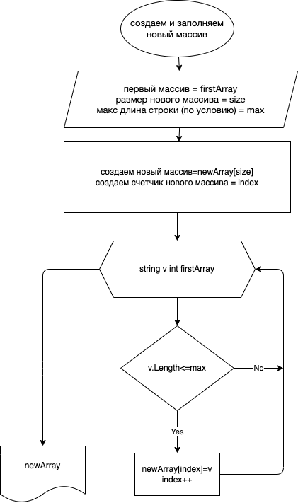

# Блок-схема

# Задача
*Написать программу, которая из имеющегося массива строк формирует новый массив из строк, длина которых меньше, либо равна 3 символам. Первоначальный массив можно ввести с клавиатуры, либо задать на старте выполнения алгоритма. При решении не рекомендуется пользоваться коллекциями, лучше обойтись исключительно массивами.*

# Примеры
* [“Hello”, “2”, “world”, “:-)”] → [“2”, “:-)”]
* [“1234”, “1567”, “-2”, “computer science”] → [“-2”]
* [“Russia”, “Denmark”, “Kazan”] → []

# Решение
1. Запрашиваем у пользователя размер массива строк;
2. Вводим с клавиатуры строки, согласно размера массива;
3. Методом вычисляем размер нового массива, на основании условия задачи (длина строк <4 символов);
4. Методом создаем новый массив, помещаем в него строки на основании условия задачи;
5. Выводим в консоль новый массив.
6. [Код](programma/Program.cs)
